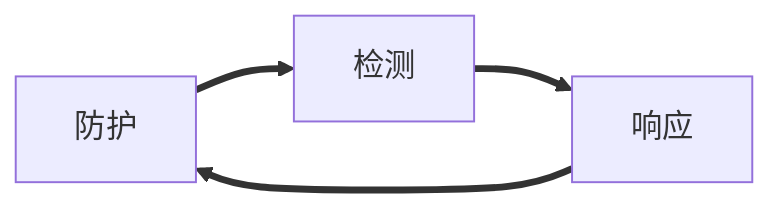

<!-- @import "[TOC]" {cmd="toc" depthFrom=1 depthTo=6 orderedList=false} -->

<!-- code_chunk_output -->

- [信息安全保障基础](#信息安全保障基础)
  - [信息安全概念](#信息安全概念)
  - [信息安全原因](#信息安全原因)
  - [信息安全的特征](#信息安全的特征)
  - [信息安全视角](#信息安全视角)
  - [信息安全保障总体要求](#信息安全保障总体要求)
- [保障的框架](#保障的框架)
  - [基于时间的PDR与PPDR](#基于时间的pdr与ppdr)
    - [核心思想](#核心思想)
  - [信息保障技术框架(IATF)](#信息保障技术框架iatf)
- [信息安全保障评估模型、框架](#信息安全保障评估模型框架)
- [参考资料](#参考资料)

<!-- /code_chunk_output -->
# 信息安全保障基础

机密性
可用性
完整性
真实性:真实是它所声称的属性，不是伪造的

可问责性
不可否认性
可靠性:在规定条件下，规定时间内完成规定功能的特性

## 信息安全概念

ISO定义: 为数据处理系统建立和采取技术、管理的安全保护，保护计算机硬件、软件、数据不因偶然的或恶意的原因而受到破坏、更改、泄露

## 信息安全原因

内因：信息系统复杂性导致漏洞的存在不可避免
外因：环境因素、人为因素

## 信息安全的特征
系统性
动态性
无边界
非传统
## 信息安全视角
国家 -> 网络战、国家机密 ->网络空间(防御、威慑、利用)
企业 -> 业务连续性、资产保护、合规性
个人 -> 隐私保护

## 信息安全保障总体要求
总体要求:积极防御，综合防御
主要原则: 技术和管理并重，正确处理安全与发展的关系

# 保障的框架

## 基于时间的PDR与PPDR

给予攻击者足够长的时间是可以攻破任何防护的。

### 核心思想
所有的防护、检测、响应都是依据安全策略实施的

**更强调控制和对抗，考虑了管理的因素，强调安全管理的持续性、安全策略的动态性。及时的检测和响应就是安全**

## 信息保障技术框架(IATF)
由美国国家安全局(NSA)制定，为保护美国政府和工业界的信息与信息技术设施提供技术指南

核心思想->深度防御
三要素: 人(防护的核心，也是最脆弱的)、技术（动态技术体系->防护、检测、响应、恢复)、操作（运行 将各方面技术紧密结合在一起的主动过程） (人通过技术进行操作)
四个焦点领域: 
保护网络和基础设施
保护区域边界
保护计算机环境
支持性基础设施

# 信息安全保障评估模型、框架
将风险和策略作为信息系统安全保障的基础和核心
强调安全贯彻信息系统生命周期

以风险和策略为基础，在整个信息系统的生命周期中实施技术、管理、工程和人员保障要素。通过信息系统安全保障实现信息安全的安全特性:保密性、完整性和可用性，从而达到保障组织机构执行其使命的根本目的。

保障要素->管理、工程、技术、人员
安全特性->保密性、完整性、机密性
生命周期->规划组织、开发采购、实施交付、运行维护、废弃

pp ->安全需求，甲方角度
ST ->乙方解决方案，安全厂商角度

# 参考资料

markdown画图
https://www.jianshu.com/p/b421cc723da5

