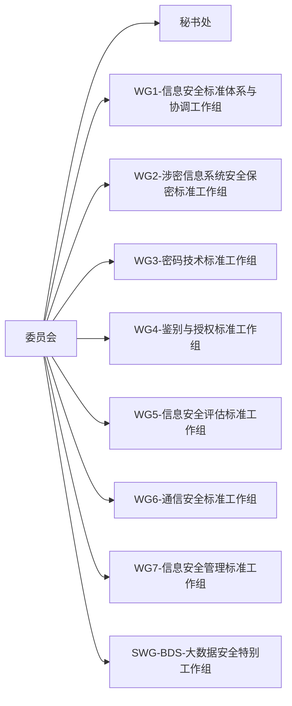

<!-- @import "[TOC]" {cmd="toc" depthFrom=1 depthTo=6 orderedList=false} -->

<!-- code_chunk_output -->

- [网络安全法](#网络安全法)
- [计算机职业道德准则](#计算机职业道德准则)
- [标准 - TC260](#标准---tc260)
  - [国际标准](#国际标准)
  - [国家标准](#国家标准)
  - [行业标准](#行业标准)
  - [地方标准](#地方标准)
- [网络安全等级保护2.0标准体系](#网络安全等级保护20标准体系)

<!-- /code_chunk_output -->

# 网络安全法
2017/6/1 开始实施，七章79条

第一章: 总则

第二章:网络安全支持与促进

第三章:网络运行安全
一般规定
关键信息基础设施的运行安全

第四章:网络信息安全

第五章:监测预警与应急处置

第六章:法律责任

第七章: 附则

# 计算机职业道德准则

维护国家、社会和公众的信息安全
诚实守信、遵纪守法
努力工作、尽职尽责
发展自身、维护荣誉

# 标准 - TC260
全国信息安全标准化技术委员会-TC260

## 国际标准

## 国家标准

## 行业标准

## 地方标准

# 网络安全等级保护2.0标准体系

定级 -》 专家 资质专家列表
http://www.djbh.net/webdev/web/QueryCpsAction.do
备案 -> 送至管辖公安局
测评 -> 第三方测评机构 机构列表 http://www.djbh.net/webdev/web/HomeWebAction.do?p=init
整改 -> 机构整改
监督/复测 -> 测评机构复测或公安检查

等保整体框架

定级测评
