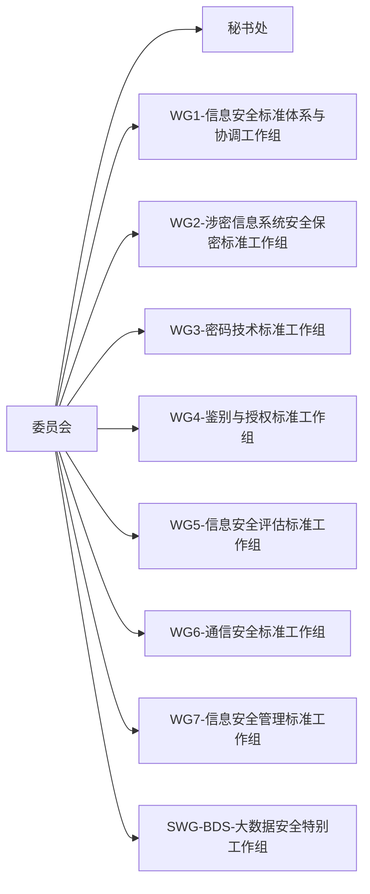

<!-- @import "[TOC]" {cmd="toc" depthFrom=1 depthTo=6 orderedList=false} -->

<!-- code_chunk_output -->

- [网络安全法](#网络安全法)
- [计算机职业道德准则](#计算机职业道德准则)
- [标准 - TC260](#标准---tc260)
  - [国际标准](#国际标准)
  - [国家标准](#国家标准)
  - [行业标准](#行业标准)
  - [地方标准](#地方标准)
- [网络安全等级保护2.0标准体系](#网络安全等级保护20标准体系)

<!-- /code_chunk_output -->

# 网络安全法
2017/6/1 开始实施，七章79条

第一章: 总则
目的 -> 确定维护网络空间主权
管理体制及分工:
国家网信部门 -> 统筹协调
国务院电信主管部门、公安部和其他部门->依法在职责范围内负责
县级以上地方人民政府及有关部门->依规定确定

域外适用效力：
监测、防御、处置->对来源境外的网络安全风险和威胁
阻断传播->来源境外的违法信息
追究法律责任->危害我国关键信息基础设施的活动

第二章:网络安全支持与促进

建立网络安全标准体系
扶持网络安全产业
开展网络安全宣传和教育
培养网络安全人才

第三章:网络运行安全

21条，实行网络安全等级保护制度
明确网络安全负责人
安全技术措施: 监测、记录，日志留存至少6个月
数据分类、备份、境内留存
应急预案

一般规定
关键信息基础设施的运行安全

第四章:网络信息安全
41条->个人信息保护原则->合法、正当、必要
42条->不泄露毁损、预防措施、补救措施
43条->删除违法、违约信息、改正有误信息

第五章:监测预警与应急处置

第六章:法律责任
民事、行政、刑事

第七章: 附则

# 计算机职业道德准则

维护国家、社会和公众的信息安全
诚实守信、遵纪守法
努力工作、尽职尽责
发展自身、维护荣誉

# 标准 - TC260
全国信息安全标准化技术委员会-TC260
GB --> 强制
GB/T -->推荐性
GB/Z --> 国家标准指导性 3年内复审

## 国际标准

## 国家标准

## 行业标准

## 地方标准

# 网络安全等级保护2.0标准体系

定级 -》 专家 资质专家列表
http://www.djbh.net/webdev/web/QueryCpsAction.do
备案 -> 送至管辖公安局
测评 -> 第三方测评机构 机构列表 http://www.djbh.net/webdev/web/HomeWebAction.do?p=init
整改 -> 机构整改
监督/复测 -> 测评机构复测或公安检查

等级保护6部分
- 安全通用要求
- 云计算安全扩展要求
- 移动互联安全扩展要求
- 物联网安全扩展要求
- 工业控制扩展要求
- 大数据安全扩展要求

等保整体框架

定级测评
