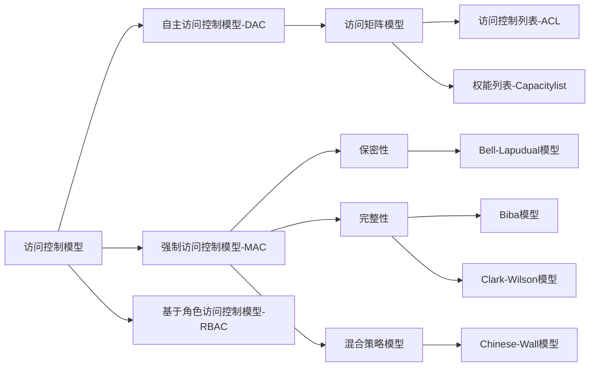

<!-- @import "[TOC]" {cmd="toc" depthFrom=1 depthTo=6 orderedList=false} -->

# 密码体系

## 古典密码

替换(凯撒密码)、置换

## 近代密码
1949-1975 香农理论

## 对称密码算法

DES
3DES
AES
IDEA
Twofish

优点->速度快
缺点->密钥交换及管理复杂
密码数量 -> n个人互相通信 需要n*(n-1)/2个密钥

## 公钥密码
1976年以后，RSA、ECC、ElGamal

1976年  Diffie & Hellman 提出非对称密钥密码
1977年 RSA公钥
90年代 椭圆曲线公钥算法

优点->密钥传递、密钥管理简单、数字签名等服务
缺点->计算复杂、耗用资源大

### 数字信封

### 数字签名
  不可伪造、不可否认、消息完整性

### PKI体系
4类实体
- CA(认证权威)
- RA(注册权威)
- 证书存放管理(目录服务)
- 证书持有者和应用程序
  

## 哈希函数

输出特定固定长度，进行完整性校验:md5、SHA-1、SHA256

数学性质: 单向性、弱抗碰撞性、强抗碰撞性

# 身份鉴别

基于实体所知(知识、密码、PIN码)
基于实体所有(身份证、钥匙、智能卡、令牌等)
基于实体特征(指纹、笔迹、声音)
双因素、多因素认证

KerberOS协议跨越认证

# 访问控制

## 访问控制模型的分类

